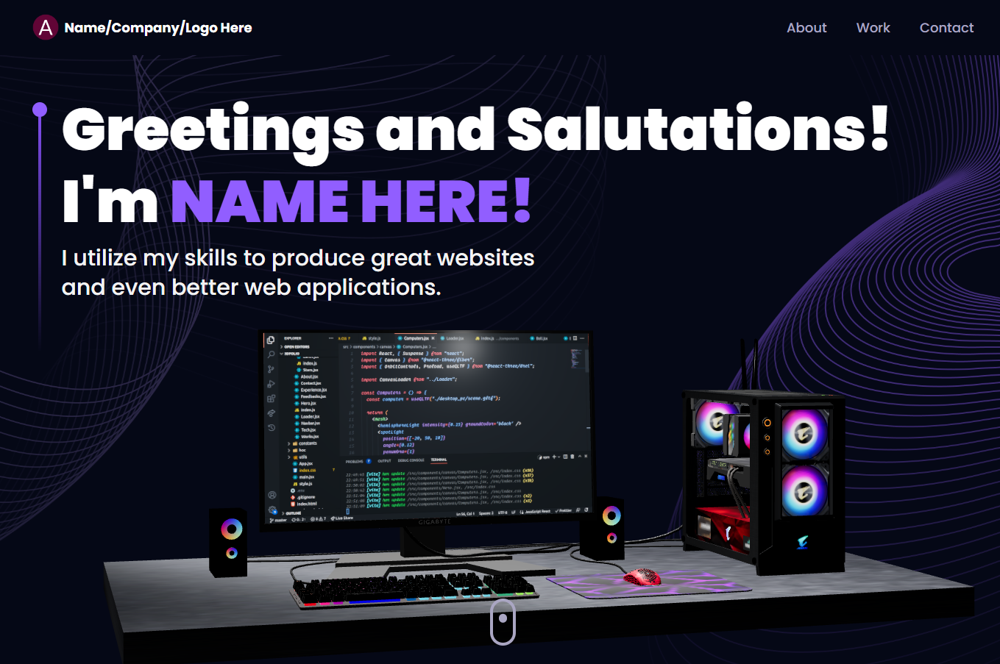

# Three JS Portfolio

An interactive and immersive developer portfolio utilizing 3D libraries and implementing animations.

## Table of contents

- [Getting Started](#getting-started)
- [Available Scripts](#available-scripts)
- [Screenshot](#screenshot)
- [Tools](#built-with)
- [Links](#links)
- [Author](#author)

## Getting Started

**Installation**

Install the project dependencies using npm:

```bash
npm install
```

**Set Up Environment Variables**

Create a new file named `.env` in the root of the project and add the following content:

```env
REACT_APP_EMAILJS_USERID=your_emailjs_user_id
REACT_APP_EMAILJS_TEMPLATEID=your_emailjs_template_id
REACT_APP_EMAILJS_RECEIVERID=your_emailjs_receiver_id
```

Replace the placeholder values with your actual EmailJS credentials. You can obtain these credentials by signing up on the [EmailJS website](https://www.emailjs.com/).

## Available Scripts

In the project directory, you can run:

### `npm run dev`

Open [http://localhost:5174/](http://localhost:5174/) to view it in your browser.

### `Ctrl + C`

Ends server

## Screenshot



## Built with

- HTML
- Tailwind CSS
- React.js
- React Three Fiber
- React Three Drei
- Three.js
- Email JS
- Vite

## Links

Tutorial: [Beginner Three.js Tutorial](https://www.youtube.com/watch?v=0fYi8SGA20k

YouTube Channel: [JavaScript Mastery](https://www.youtube.com/@javascriptmastery)

## Author

- LinkedIn - [@avion-cobb](https://www.linkedin.com/in/avion-cobb/)
- Twitter - [@Blvck_Lotus003](https://twitter.com/Blvck_Lotus003)